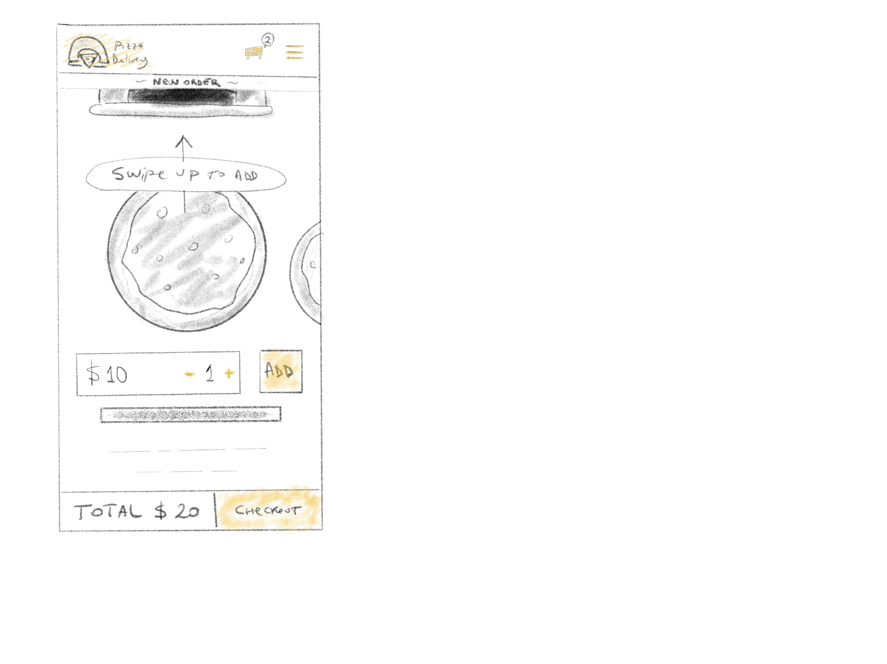
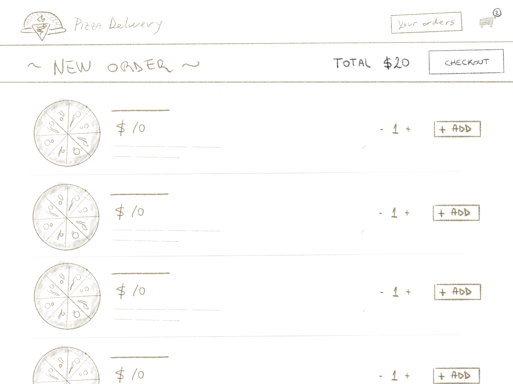
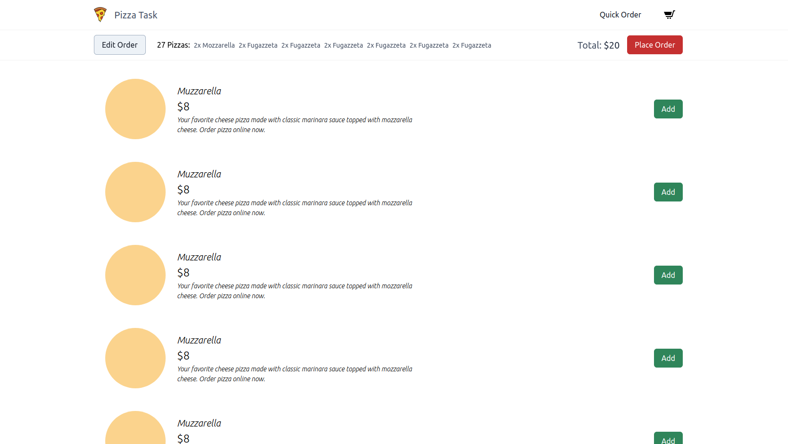

## The Creative Design Process

### DAY 1

After I read the task description,

I found myself seaching for [pizza pictures](https://www.pexels.com/search/pizza/) I could use in the app.

I decided I'll spend an hour drawing some wireframes in Procreate to get my ideas down to something clear and implementable given the timeframe (I don't want to spend too much tweaking and fixing UI on the development process, for me that's often a bad idea).

Ok, this is what came up from the sketch session:

#### Hands to work

### Stack

As per the recomendations, I've choosen the following stack to create the Front End experience:

- React.js (for quick boilerplate create-react-app)

I've commited some components to get a file architecture in place and their correspondent tests files, all empty of course, but just for now ;)

- Tailwind (https://tailwindcss.com/)

### DAY 2

Took me 1 day to implement the responsive styles of the app.

I'll implement mobile swipe version when I get to a stable version.

Here is the result:

After a little tweaking I've decided to stick to the sketchs, will add the (-) button to the side of the (Add) to remove one pizza at the time.
